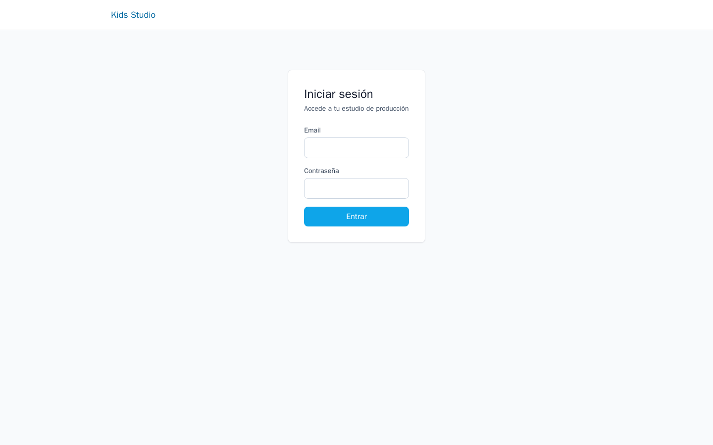

# Kids Studio

> AI production studio for original children's video

**Live:** [https://kids-studio.alcuavi.com](https://kids-studio.alcuavi.com) · **Category:** AI / Media pipeline

## Overview

Kids Studio is a Turborepo monorepo (Next.js + NestJS) that turns a one-line idea into an exportable children's video through a ~14-step gated pipeline: script, vocal song, audio, storyboard, visual generation, lip-sync, FFmpeg render, subtitles, mandatory child-safety QA, and export — with credit-based cost governance and IP/originality protection.

## Problem → Solution

**Problem.** AI video tools are powerful but unsafe for kids' content without structure: trademark risk, prompt injection, unpredictable API cost, and no enforceable safety gate before export.

**Solution.** A step DAG in a shared `@kids-studio/pipeline` package drives NestJS workers. Each AI-costly step is pre-checked against a credit ledger; prompts pass an originality validator; Claude-based child QA **blocks** export on failure; FFmpeg runs in-container for render/subtitles/thumbnails.

## Key capabilities

- 14-step pipeline with versioning, approvals, and full vs quick production modes
- Originality validator: blocks known children's-media brands + prompt-injection patterns (locale-aware)
- Credit guard + provider balance tracking with auto-resume when budget replenishes
- Deterministic per-scene visual seeds (FNV-1a) for continuity without custom model training
- Non-bypassable `QA_CHILD` gate wired into export — safety is structural

## Skills demonstrated

- DAG-based media pipelines
- Defensive prompt/IP engineering
- FinOps for generative workloads
- Server-side FFmpeg orchestration
- Child-safety gates in production AI

## Tech stack

- Next.js 15, NestJS, Prisma, BullMQ, Turborepo
- PostgreSQL, Redis, MinIO (public endpoint for provider fetch)
- OpenAI, ElevenLabs, Suno, Runway/FAL video, FAL lip-sync, Claude (QA), FFmpeg
- Docker + Traefik on VPS

## Screenshots

_Sanitized captures — no credentials, customer data, or private business figures._

### Production entry screen (single-owner deployment)

See also: [docs/screenshots/README.md](docs/screenshots/README.md)

## Documentation

| Document | Description |
|----------|-------------|
| [Architecture](./docs/architecture.md) | Components, data flow, diagrams |
| [Technical decisions](./docs/technical-decisions.md) | Trade-offs and rationale |
| [Scope & privacy](./docs/scope-and-privacy.md) | What this case study shows / omits |

## Private source

Application code: [`Alcuavi/kids-studio`](https://github.com/Alcuavi/kids-studio) (private repository)

## Honesty note

YouTube publish step is intentionally a metadata stub — personal MVP scope. Production web/API are deployed for single-owner use.

## What we intentionally do not publish here

- API keys, JWT secrets, seed owner credentials
- Owner-generated characters/video assets (private IP)
- Internal FAL spend guardrail playbooks

---

## About the author

**Alberto Cuadrado** — Full Stack Developer building AI-powered products, internal tools, and production systems.

- Portfolio: [alcuavi.com](https://alcuavi.com)
- GitHub: [@Alcuavi](https://github.com/Alcuavi)

## Repository notice

This is a **public case study**. Application source code lives in a **private repository** linked above. This repo intentionally contains documentation only — no secrets, credentials, customer data, or proprietary media assets.
