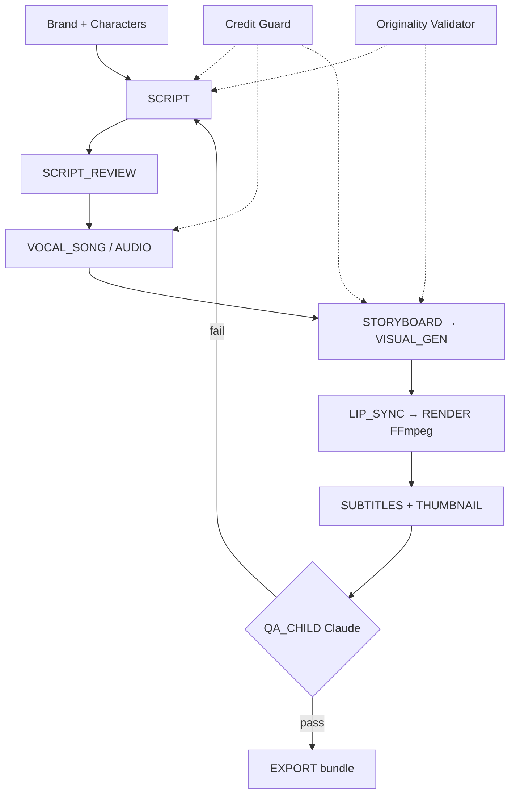

# Architecture — Kids Studio

## System context

Kids Studio is a Turborepo monorepo (Next.js + NestJS) that turns a one-line idea into an exportable children's video through a ~14-step gated pipeline: script, vocal song, audio, storyboard, visual generation, lip-sync, FFmpeg render, subtitles, mandatory child-safety QA, and export — with credit-based cost governance and IP/originality protection.

## Diagram

## Data & trust boundaries

- **Public case study (this repo):** documentation and diagrams only.
- **Private application repo:** [`Alcuavi/kids-studio`](https://github.com/Alcuavi/kids-studio) — credentials, customer data, and proprietary assets stay there.
- **Production deployment:** https://kids-studio.alcuavi.com

## Operational notes

YouTube publish step is intentionally a metadata stub — personal MVP scope. Production web/API are deployed for single-owner use.
